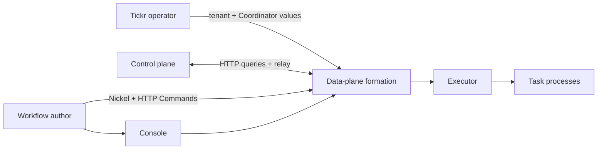

# Control plane and Data plane

Tickr divides tenant-wide coordination from the runtime that authors and executes workflows.

## Control plane

The external Control plane provides the Coordinator endpoints used for live queries and the bidirectional Conductor relay. Your operator provisions access and gives the Data plane its tenant slug and Coordinator URLs.

Tickr Lite does not embed, create, or administer a Control plane.

## Data plane

The Data plane owns tenant workflow operations:

- workflow source registration and build state;
- durable workflow definitions and terminal Run projections;
- live task coordination;
- Task execution and cancellation;
- Task context;
- Events, Signals, Patches, and replays;
- Task logs;
- the HTTP API and Console.

A **formation** is one complete admitted Data-plane profile. Tickr supports `lite-local`, `all-nats`, and `all-redis`. Profiles select a complete topology and role-specific contracts; they are not interchangeable broker settings.

## Failure boundary

Formation readiness and Control-plane health are related but distinct. After admission, loss of Control-plane reachability degrades its health component without reinterpreting or discarding local durable state.

Work-producing routes remain governed by formation readiness. `/api/health` stays available for diagnosis when readiness is false.
