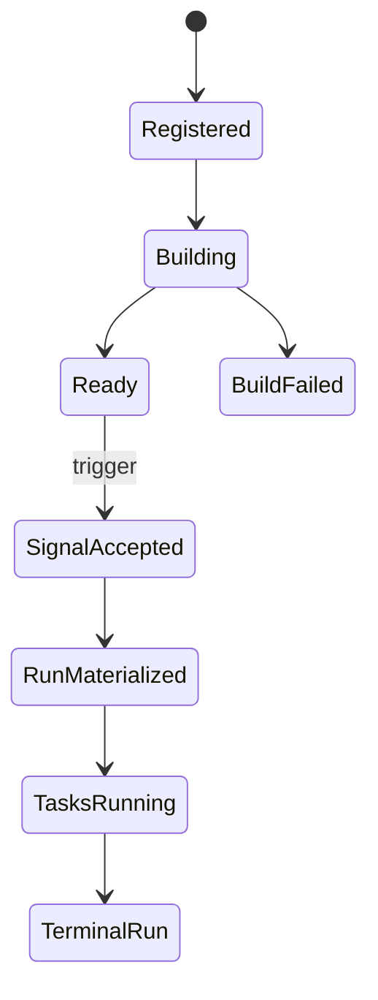

# Execution lifecycle

Tickr exposes asynchronous work as explicit durable stages. Treat the identifier returned by one stage as the handle for observing the next stage—not as proof that the final outcome already happened.

## Definition lifecycle

1. A client submits Nickel source.
2. Tickr returns a Workflow definition identity.
3. The definition enters `Building`.
4. A successful build reaches `Ready`; a rejected build reaches `BuildFailed` with a diagnostic.
5. Each accepted registration creates or addresses a versioned definition.

Only `Ready` definitions can produce Runs.

## Trigger lifecycle

1. A client triggers a ready definition.
2. Tickr accepts a Signal and returns its identity.
3. The Signal is durably resolved.
4. A materialized trigger Signal records its `workflow_instance_id`.
5. That identity addresses the Run.

A trigger response therefore proves Signal acceptance, not Run completion.

## Run and Task lifecycle

A Run materializes the authored graph. Runnable Tasks are claimed by an Executor within the selected formation. A Task attempt carries an attempt/generation identity so retries and recovery do not collapse distinct executions into one state.

## Terminal outcomes

Read the Run and its Tasks separately. A terminal Task log and terminal Run projection are durable read surfaces; transient coordination messages are not the authority for final state.

When a request times out, do not assume the mutation was cancelled. A command may have been accepted by the writer and completed after the caller stopped waiting. Reconcile by the returned identity or an idempotency identity exposed by that operation.
