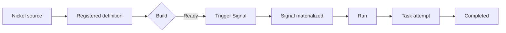

# Run your first workflow

This guide assumes Tickr Lite is running, its health projection reports `readiness.ready: true`, and your terminal has sourced `tickr-lite.env`.

## Register Hello

Build the request as a file so the Nickel source is transmitted exactly:

```bash
jq -n --rawfile source "$TICKR_HOME/examples/hello-world.ncl" \
  '{namespace:"default", nickel_source:$source}' \
  > hello-register-request.json

curl -fsS -X POST "$TICKR_API_URL/api/workflows/register" \
  -H 'Content-Type: application/json' \
  -d @hello-register-request.json |
  tee hello-register-response.json

hello_workflow_id="$(jq -er '.workflow_id' hello-register-response.json)"
printf 'workflow_id=%s\n' "$hello_workflow_id"
```

Registration acknowledges an asynchronous build. It does not mean the workflow is ready to trigger.

## Inspect the build

Fetch the current build state once:

```bash
curl -fsS "$TICKR_API_URL/api/workflows" |
  jq --arg id "$hello_workflow_id" \
    '.[] | select(.id == $id) | {id, slug, version, build_status}'
```

- `Ready`: the workflow can run.
- `Building`: fetch this resource again later.
- `BuildFailed`: stop and inspect the build diagnostic. Do not trigger the definition.

## Trigger a Run

```bash
curl -fsS -X POST \
  "$TICKR_API_URL/api/workflows/$hello_workflow_id/trigger" \
  -H 'Content-Type: application/json' \
  -d '{"name":"my first Tickr run"}' |
  tee hello-trigger-response.json

hello_signal_id="$(jq -er '.signal_id' hello-trigger-response.json)"
printf 'signal_id=%s\n' "$hello_signal_id"
```

The trigger returns a Signal identity. The resulting Run does not exist until that Signal materializes.

## Resolve the Signal

Fetch its state once:

```bash
curl -fsS "$TICKR_API_URL/api/signals/$hello_signal_id" |
  tee hello-signal-status.json |
  jq '{status, workflow_instance_id}'
```

When `status` is `materialized`, record the Run identity:

```bash
hello_run_id="$(jq -er '.workflow_instance_id' hello-signal-status.json)"
curl -fsS "$TICKR_API_URL/api/workflows/instances/$hello_run_id/tasks" |
  jq '.[] | {id, name, state, attempt}'
```

When the `hello` Task reaches `Completed`, its terminal log contains:

```text
hello from Tickr
```

You can inspect the Run and Task log in Console or through the Task-log API.

## What just happened



Each arrow is an observable state transition. A successful HTTP response at one stage does not imply completion of the next stage.
