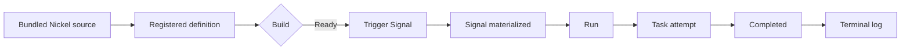

# Run your first workflow

This guide assumes `./tickr setup` completed successfully.

Run the bundled Hello workflow:

```bash
./tickr examples run hello-world
```

If the local API is unavailable, the command verifies the local migration,
starts Tickr Lite, waits for readiness, and stops the process it owns after the
example. If Tickr Lite is already running, the command uses it and leaves it
running.

The command then follows each durable transition:



A successful run prints:

```text
Running bundled example `hello-world`:
  Tickr Lite: ready
  Workflow: Ready (<workflow-id> version <version>)
  Run: Completed (<run-id>)
Output:
hello from Tickr
```

The Workflow, Signal, Run, and Task identities come from the API responses; the
command never guesses them or treats an accepted request as completion.

For ongoing use, start Tickr Lite in the foreground:

```bash
./tickr tickr-lite
```

Then open the embedded Console at
[http://127.0.0.1:6000/](http://127.0.0.1:6000/).
